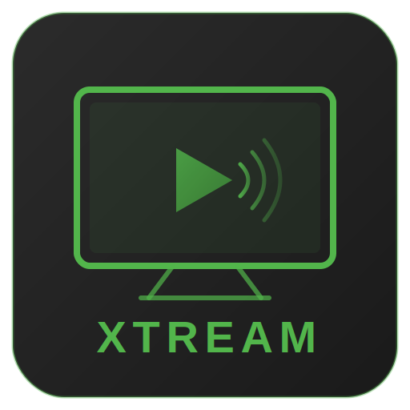

<p align="center">
  
</p>

<h1 align="center">Xtream Tuner</h1>

<p align="center">
  An Emby Server plugin that turns any Xtream-compatible IPTV service into a full Live TV, Movies, and Series library — with EPG, metadata matching, and a built-in dashboard.
</p>

<p align="center">
  
  
  
</p>

---

## Features

### Live TV & EPG

Full Live TV integration with Emby's native TV guide.

- **M3U playlist generation** with channel metadata, logos, and EPG channel IDs
- **XMLTV electronic program guide** with configurable fetch window (1-14 days)
- **Category-based filtering** — select which channel groups to include
- **Catch-up / Timeshift** — access previously aired content (configurable 1-30 day lookback)
- **Stream format selection** — MPEG-TS or HLS (M3U8)
- **Adult content filtering** — opt-in toggle for adult-flagged channels
- **Automatic caching** — M3U (15 min) and EPG (30 min) with thread-safe invalidation

### VOD Movie Library

Sync on-demand movies as STRM files that Emby treats as a native movie library.

- **STRM file generation** — one file per movie, Emby handles metadata and artwork
- **Folder organization modes:**
  - **Single folder** — all movies in one `Movies/` directory
  - **Multiple folders** — auto-organized by provider category name
  - **Custom mapping** — define your own folders and assign categories to each
- **TMDB metadata matching** — appends `[tmdbid=123]` to folder names for instant Emby identification
- **TMDB fallback lookup** — queries Emby's metadata providers when the Xtream source lacks a TMDB ID
- **Category selection** — pick specific VOD categories to sync, or sync all
- **Danger zone** — one-click delete of all synced movie content

### TV Series Library

Full series support with proper season/episode structure.

- **Season/Episode STRM files** — `Show Name/Season 01/Show Name - S01E01 - Episode Title.strm`
- **Series detail fetching** — pulls episode lists per series from the Xtream API
- **TVDb / TMDB ID folder naming** — `Show Name [tvdbid=81189]` for reliable metadata matching
- **Manual ID overrides** — force a specific TVDb ID for shows that don't auto-match
- **Metadata fallback lookup** — searches Emby's providers when no ID is available
- **Same folder modes as movies** — single, multiple, or custom category mapping

### Smart Sync Engine

Efficient sync that doesn't re-download what you already have.

- **Smart skip** — skips writing STRM files that already exist on disk
- **Configurable parallelism** — 1-10 concurrent operations (default 3)
- **Orphan cleanup** — automatically removes STRM files for content no longer in the source
- **Cross-listing deduplication** — movies/series appearing in multiple categories are synced once
- **Content name cleaning** — strips provider prefix tags (e.g. `|UK|`, `|FR|`) and custom terms from titles
- **Real-time progress** — Phase, Total, Completed, Skipped, Failed counters polled every 500ms

### Dispatcharr Integration

Optional integration with [Dispatcharr](https://github.com/Dispatcharr/Dispatcharr) for IPTV stream management.

- **Stream proxy routing** — routes Live TV through Dispatcharr's proxy for connection management
- **Pre-populated media info** — fetches codec, resolution, and bitrate from Dispatcharr's stream stats
- **FFprobe bypass** — skips Emby's stream analysis when stats are available (faster channel switching)
- **JWT authentication** — automatic token refresh with retry and exponential backoff
- **Graceful fallback** — reverts to direct Xtream URLs if Dispatcharr is unavailable

### Built-in Dashboard

A configuration UI embedded in Emby's plugin settings with five tabs.

- **Dashboard** — last sync status, sync history (last 10), library stats, live progress bar
- **Settings** — server connection, sync tuning, name cleaning, metadata matching
- **Movies** — enable/disable, folder mode, category selection with search, sync button
- **Series** — same layout as movies with series-specific options
- **Live TV** — stream format, EPG settings, catch-up, Dispatcharr, category filtering

---

## Deployment Guide

### Prerequisites

- **Emby Server 4.8+** running (bare metal or Docker)
- **.NET SDK 6.0+** installed on your build machine
- An **Xtream-compatible IPTV provider** (or [Dispatcharr](https://github.com/Dispatcharr/Dispatcharr))

### Step 1: Build the Plugin

```bash
git clone https://github.com/<your-username>/emby-xtream.git
cd emby-xtream/Emby.Xtream.Plugin
bash build.sh
```

The compiled DLL will be at:
```
Emby.Xtream.Plugin/out/Emby.Xtream.Plugin.dll
```

### Step 2: Install the Plugin

Copy the DLL to your Emby Server's plugins directory.

**Docker (most common):**
```bash
docker cp Emby.Xtream.Plugin/out/Emby.Xtream.Plugin.dll emby:/config/plugins/
docker restart emby
```

**Bare metal (Linux):**
```bash
cp Emby.Xtream.Plugin/out/Emby.Xtream.Plugin.dll /var/lib/emby/plugins/
systemctl restart emby-server
```

**Bare metal (macOS/Windows):**
Copy `Emby.Xtream.Plugin.dll` to your Emby data directory under `plugins/`, then restart Emby Server.

> Only the single `Emby.Xtream.Plugin.dll` file is needed. No other dependencies to copy.

### Step 3: Configure the Plugin

1. Open Emby's web UI
2. Go to **Settings > Plugins > Xtream Tuner**
3. Enter your Xtream server details:
   - **Server URL** — e.g. `http://your-provider:port`
   - **Username** and **Password**
4. Click **Test Connection** to verify
5. Click **Save**

### Step 4: Set Up Live TV

1. Switch to the **Live TV** tab
2. Choose your **Stream Format** (MPEG-TS recommended)
3. Click **Refresh Categories** to load channel groups
4. Select the categories you want
5. Configure **EPG** settings (days to fetch, cache duration)
6. Enable **Catch-up** if your provider supports it
7. Click **Save**
8. Go to **Emby Settings > Live TV** and add a new tuner:
   - Type: **Xtream Tuner**
   - It will auto-discover the plugin's M3U and EPG endpoints

### Step 5: Set Up Movies (Optional)

1. Switch to the **Movies** tab
2. Check **Enable VOD Movies**
3. Click **Refresh Categories** to load VOD categories
4. Choose a **Folder Organization** mode:
   - **Single Folder** — select categories, all movies go to `Movies/`
   - **Multiple Folders** — one folder per category, auto-named
   - **Custom** — click "Add Folder", name it, assign categories
5. Click **Sync Movies Now**
6. In Emby, add a new **Movies** library pointing to the STRM output path (default: `/config/xtream/Movies`)

### Step 6: Set Up Series (Optional)

1. Switch to the **Series** tab
2. Check **Enable Series / TV Shows**
3. Same workflow as Movies — refresh categories, select, choose folder mode
4. Click **Sync Series Now**
5. In Emby, add a new **TV Shows** library pointing to `/config/xtream/Shows`

### Step 7: Dispatcharr Integration (Optional)

If you use [Dispatcharr](https://github.com/Dispatcharr/Dispatcharr) for stream management:

1. Go to **Live TV** tab > **Dispatcharr** section
2. Check **Enable Dispatcharr**
3. Enter Dispatcharr URL, username, and password
4. Click **Test Dispatcharr** to verify
5. Save — Live TV streams will now route through Dispatcharr's proxy

### Updating the Plugin

Build the new version and replace the DLL:

```bash
cd emby-xtream/Emby.Xtream.Plugin
bash build.sh
docker cp out/Emby.Xtream.Plugin.dll emby:/config/plugins/
docker restart emby
```

Your configuration is preserved across updates.

---

## Configuration Reference

| Setting | Default | Description |
|---|---|---|
| **Stream Format** | MPEG-TS | Live TV container format (`ts` or `m3u8`) |
| **EPG Cache** | 30 min | How long to cache EPG data (5-1440 min) |
| **EPG Days** | 2 | Days of guide data to fetch (1-14) |
| **M3U Cache** | 15 min | How long to cache channel playlists (1-1440 min) |
| **Catch-up Days** | 7 | Timeshift lookback window (1-30 days) |
| **STRM Library Path** | `/config/xtream` | Where STRM files are written |
| **Smart Skip** | On | Skip existing STRM files during sync |
| **Sync Parallelism** | 3 | Concurrent operations during sync (1-10) |
| **Cleanup Orphans** | Off | Remove STRM files not in source |
| **TMDB Folder Naming** | Off | Append `[tmdbid=X]` to movie/series folders |
| **Fallback Lookup** | Off | Query Emby's metadata providers for missing IDs |
| **Name Cleaning** | Off | Strip prefix tags and custom terms from titles |

---

## License

MIT
